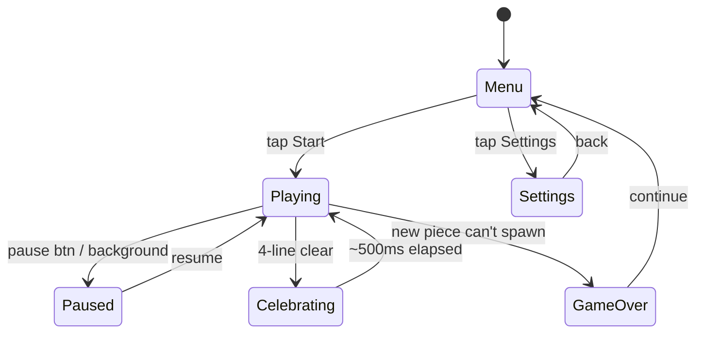

# Plan: TesseraRiss — minimalist falling-blocks iOS game

## Context

A free, no-ads, no-IAP, OG-feel falling-blocks puzzle for iOS — comforting visuals, big-button touch controls, haptics, royalty-free *Korobeiniki* music, NES scoring + level progression. Name: **TesseraRiss** — Latin *tessera* ("four-sided tile") + German *Riss* ("tear / rip / fissure") = "tear the tiles," the player's goal. Developer is new to iOS but has Claude Max for pair-coding plus developer friends for review, so the v1 scope extends beyond core gameplay to include starting-level select, a stats page, a daily-challenge mode, iCloud highscore sync, Reduce Motion support, and a real test suite (unit + statistical + UI smoke). Realistic ship window: **5 weeks**.

## State flow



---

## Decisions locked in

Everything previously deferred to "open questions" is now committed to a default. Items marked ⚠ are non-trivial departures from a naive read of the OG; rationale is given inline.

| Area | Decision |
|---|---|
| App name | **TesseraRiss** (verify App Store availability week 1; fallbacks: Tessera, Stackfall) |
| Min iOS | iOS 17+ (Observable macro + broad device coverage) |
| Devices | iPhone only, portrait-locked (iPad/landscape later) |
| Rotation | **Single CW button** — three taps = CCW. Matches the minimalist control aesthetic; accept the cost on common J/L pieces |
| Lock delay | 0ms (NES-style instant lock) |
| Randomizer | **Soft anti-drought weighted RNG** — memoryless at heart, with weights 3 (absent from last 6) vs 2 (present in last 6). See "Randomizer" below |
| Hard drop | Yes, no scoring bonus (expected by modern touch players) |
| Soft drop scoring | +1 point per cell while ▼ held (NES rule — was missing from prior plan) |
| Hold piece / ghost piece | Neither (both are post-OG) |
| DAS (touch hold) | 270ms initial delay, then 50ms repeat for ◀ / ▶ / ▼ |
| Level progression | **No hard cap.** NES gravity table for levels 0–19, then a smooth saturation curve approaching a 20ms/cell floor (see Gravity table). Further levels just keep getting *a bit* faster |
| Pause | Pause button in GameView; auto-pause on `scenePhase != .active` |
| Audio session | `.ambient` — lets user's external audio (podcast) keep playing if preferred |
| Audio formats | `.m4a` for music (AAC, smaller/faster than mp3), `.caf` for SFX |
| Music source | Pixabay CC0 search "korobeiniki" — pick a clean 30–60s seamless loop in week 1. Fall back to FreeMusicArchive |
| SFX source | Pixabay / Freesound CC0; warm chiptune chime for tetris.caf, not arcade buzz |
| Highscore | Single integer in `UserDefaults`, key `"tesserariss.highscore"`; mirrored to iCloud KVS when sync toggle ON |
| Highscore display | Single best score on menu (no leaderboards) |
| Extended v1 features | Starting-level picker, Stats page, Daily challenge (seeded), iCloud sync toggle, Reduce Motion support |
| Testing | XCTest unit + statistical tests for `Board` / `Scoring` / `Randomizer` / `Tetromino` / `SeededPRNG`; XCUITest smoke tests; GitHub Actions CI on push |
| Accessibility | Reduce Motion respected on Tetris celebration; rest of UI uses dynamic type and high-contrast palette by default |

---

## Randomizer

Pure-uniform random (1/7 each, independent draws) produces long, demoralizing droughts on touch. Modern **7-bag** fixes that but at the cost of feeling pseudorandom — once a piece appears, you know it can't reappear until the next bag fills. NES Tetris itself uses something in between: a memoryless draw with a 1-step re-roll that biases mildly against immediate repeats.

This plan uses a generalization of NES's idea: **memoryless weighted draw with a 6-piece history window.** Each draw is genuinely independent (no hard guarantees, any sequence is possible) but pieces that have been seen recently are slightly down-weighted, so droughts of common pieces are rare and immediate repeats are uncommon — without ever locking the player into a predictable cadence.

**Weights:**

| Piece state | Weight |
|---|---|
| Absent from the last 6 picks | **3** |
| Present in the last 6 picks | **2** |

**Probabilities in the steady state** (after 6 draws have filled the history):

| History composition | Drought piece P | Recent piece P |
|---|---|---|
| 6 distinct in history → 1 piece absent | **3/15 = 20.0%** | 2/15 ≈ 13.3% |
| 5 distinct in history → 2 pieces absent | 3/16 ≈ 18.8% | 2/16 = 12.5% |
| 4 distinct → 3 absent | 3/17 ≈ 17.6% | 2/17 ≈ 11.8% |

A piece that's just been drawn is guaranteed to sit at weight 2 for at least the next 6 draws — that's the "slight bump down" baked in. As soon as it ages out of the window, it pops back up to 20%-ish, so genuine droughts self-correct quickly.

**Implementation note**: `GameEngine` holds `var recent: [PieceKind] = []` (capacity 6). To draw the next piece:

```
let absent = Set(PieceKind.allCases).subtracting(recent)
let weights = PieceKind.allCases.map { absent.contains($0) ? 3 : 2 }
let pick = weightedRandom(PieceKind.allCases, weights)
recent.append(pick); if recent.count > 6 { recent.removeFirst() }
```

**Preview semantics**: `recent` records a piece *the moment it's drawn from the generator*, not when it becomes the current piece. The next-piece preview is therefore an eagerly-drawn lookahead — when the current piece locks, the lookahead becomes current and a fresh lookahead is drawn. This means the visible preview is "in history" too, which is what the player intuits: if you can see an L is coming, the randomizer knows it's coming.

**Departures from pure NES**: NES's window is effectively 1; this plan's window is 6. NES has no "drought boost"; this plan boosts absent pieces to ~20%. The feel is "random with a gentle floor" rather than "bag-deterministic". Documented here so it's a known design choice.

---

## Tech stack

- **Swift 5+**, **SwiftUI** end-to-end. No SpriteKit — the playfield is a 10×20 grid of colored rectangles, well within SwiftUI's comfort zone and far friendlier for a first iOS project.
- **`@Observable`** macro (iOS 17+) for `GameEngine` — simpler than `ObservableObject`.
- **Audio**: `AVAudioPlayer` — one instance for music, separate pre-loaded instances per SFX (overlapping playback works cleanly).
- **Audio session**: category `.ambient`.
- **Haptics**: `UIImpactFeedbackGenerator` (`.light` on move, `.medium` on lock) + `UINotificationFeedbackGenerator` (`.success` on Tetris).
- **Persistence**: `UserDefaults`. No SwiftData / Core Data.
- **Xcode**: latest.

---

## Game architecture (lightweight MVVM)

```
Models/
  Tetromino.swift           // shape matrix, rotation states, color
  Board.swift               // 10×20 grid, collision, line detection/clearing

Engine/
  GameState.swift           // enum: menu, playing, paused, celebrating(rows), gameOver
  Scoring.swift             // pure functions: pointsFor(clear:, level:), gravityMs(level:)
  GameEngine.swift          // @Observable; holds Board, current/next, score, level, lines, state;
                            // drives loop with Timer.publish at gravityMs(level)

Services/
  AudioController.swift     // singleton; music + pooled SFX players
  HapticController.swift    // thin wrappers, respects haptics-off setting

Views/
  TesseraRissApp.swift      // @main
  MenuView.swift            // start, highscore, start-level picker, daily mode, stats, settings entry
  GameView.swift            // playfield + next-piece preview + score/level/lines + pause btn
  ControlsView.swift        // 5 big buttons (see Controls)
  CellView.swift            // single 10×10 grid cell
  SettingsView.swift        // music on/off, haptics on/off, iCloud sync, about/credits
  StatsView.swift           // lifetime totals (see Extended v1 features)
  GameOverView.swift        // final score + "NEW BEST" + Play Again / Menu
```

---

## Extended v1 features

The core gameplay above is the shippable minimum. With AI-assisted coding + developer friends available for review, v1 also ships the following — each one is a contained learning opportunity for a specific iOS subsystem.

### Starting level select (NES-style)
The menu has a "Start Level" picker (0–19). `GameEngine.init(startLevel:)` initializes `level` from the picker; the lines-to-next-level counter still increments by 1 per line cleared toward the next ×10 threshold. Tiny addition, big agency win — players who only want fast games can start at 9.

### Stats page
A "Stats" screen linked from the menu shows local lifetime totals:

- Games played
- Total lines cleared
- Tetrises (4-line clears)
- Highest level reached
- Longest tetris streak (consecutive 4-line clears without a 1–3 line break between)
- Total play time (HH:MM)

Persisted via `UserDefaults` under keyspace `"tesserariss.stats.*"`. Long-press the screen title for a reset confirmation. No remote sync (kept local for simplicity).

### Daily challenge
A "Daily" entry on the menu. Seeded RNG (seed = ISO date `YYYY-MM-DD` in the device's local timezone), starting level 5, no level-up (level frozen). One attempt per day; the day's best is recorded locally with its date. Comforting routine, a small ritual to come back to.

Implementation note: the soft anti-drought randomizer is parameterized over a `RandomNumberGenerator`. For Daily mode, inject a seeded SipHash-based PRNG (Swift's `RandomNumberGenerator` protocol — ~30 lines). The weights are unchanged; only the underlying random source differs. Every player gets the same piece sequence on the same calendar date.

### iCloud highscore sync
Settings toggle: "Sync highscore to iCloud" (default ON). Implemented with **`NSUbiquitousKeyValueStore`** (the lightweight key-value iCloud store — not full CloudKit, no schema management). Single key `"tesserariss.highscore"`. Falls back gracefully to local-only if the user isn't signed in. Daily challenge scores stay local.

### Reduce Motion support
`@Environment(\.accessibilityReduceMotion)` — when enabled at the OS level, the Tetris celebration **skips** the screen-pulse scale animation and the row flash becomes a single bright hold instead of a two-cycle flash. Chime + haptic unchanged. Single-line change in `GameView`.

---

## Testing strategy

A dedicated `TesseraRissTests` target (XCTest) sits next to the app target. Three layers, increasing in cost.

### Unit tests (~25 tests, pure-Swift, fast)

`BoardTests`:
- empty board has no collisions for any spawn
- piece at the floor collides on downward shift
- piece at the wall collides on lateral shift into the wall
- a fully-filled row is detected by `linesToClear()`
- clearing a row preserves rows below and drops rows above by 1
- 4-line simultaneous clear collapses correctly with no gaps

`ScoringTests`:
- level 0: single = 40, double = 100, triple = 300, tetris = 1200
- level 1: all values exactly doubled
- soft-drop awards +1 per cell while ▼ is held
- `gravityMs(0) == 800`, `gravityMs(19) == 33`, `gravityMs(20) == 32`, `gravityMs(60)` within ±1 of 20

`RandomizerTests`:
- 100k draws: each of the 7 pieces sampled in [12,000, 16,000] (rough uniformity)
- with 6 distinct pieces in the history window, the absent piece appears within the next 10 draws ≥ 99% of the time
- immediate-repeat rate (same piece twice in a row) < 14% of adjacent pairs (vs. ~14.3% for pure uniform — confirms the anti-repeat bias)

`TetrominoTests`:
- rotating any piece 4 times == identity
- O-piece is rotation-invariant
- spawn positions for each piece match expected origin

### Statistical / property tests (~3 tests)

For the randomizer specifically:
- empirical drought-piece probability ∈ [0.18, 0.22] over 200k draws (matches the 3/15 = 20% target within sampling noise)
- max observed consecutive misses for *any* piece ≤ 25 over 200k draws (drought tail is bounded in practice — drought of 25 should be rarer than one-in-a-million)
- distribution chi-square vs uniform: p-value > 0.001 (we expect *some* non-uniformity, but not pathological)

### UI smoke tests (~5 tests, XCUITest)

- launch → menu visible → tap Start → game view visible
- tap ROTATE 4 times → piece returned to original orientation (assert via accessibility identifier on the playfield cells)
- tap PAUSE → "Paused" overlay visible → tap Resume → returns to play
- hold ◀ for 1s → piece moves multiple cells (DAS engaged)
- game-over flow: trigger top-out via a `#if DEBUG` `forceGameOver()` test hook → menu's highscore updates

### CI

GitHub Actions on every push: `xcodebuild test -only-testing:TesseraRissTests` runs the unit + statistical layers. UI smoke tests run manually before each release tag (simulator UI tests are flaky and not worth blocking commits on).

---

## Scoring

Per line-clear (`level` starts at 0):

| Clear | Points |
|---|---|
| Single | 40 × (level + 1) |
| Double | 100 × (level + 1) |
| Triple | 300 × (level + 1) |
| **Tetris (4)** | **1200 × (level + 1)** |
| Soft drop | +1 per cell while ▼ held |

Level rises +1 every 10 lines cleared.

## Gravity table

NES curve for levels 0–19. From level 20 onward, a smooth exponential saturation toward a 20ms/cell floor — no cliff, just a bit faster each level until it effectively stops mattering. `GameEngine` reads this from `Scoring.gravityMs(level:)`.

**Formula**:

```
gravityMs(level) =
  if level ≤ 19:  NES table below (lookup)
  else:           round(20 + 13 × 0.92^(level − 19))
```

| Level | ms/cell | Notes |
|---|---|---|
| 0 | 800 | NES table |
| 1 | 717 | |
| 2 | 633 | |
| 3 | 550 | |
| 4 | 467 | |
| 5 | 383 | |
| 6 | 300 | |
| 7 | 217 | |
| 8 | 133 | |
| 9 | 100 | |
| 10–12 | 83 | |
| 13–15 | 67 | |
| 16–18 | 50 | |
| 19 | 33 | last NES table entry |
| 20 | 32 | saturation curve begins |
| 25 | 28 | |
| 30 | 25 | |
| 40 | 22 | |
| 60 | 20 | effectively at floor |
| 100+ | 20 | floor (50 cells/sec — practical limit) |

---

## Line-clear feedback

**Tetris (4-line)**:
- `GameState = .celebrating(rows: [r1, r2, r3, r4])`. Game loop skips gravity ticks while in this state.
- Pause gravity ~500ms total.
- Visual: the four cleared rows flash white → palette color twice (~100ms per half-cycle); brief screen pulse scale 1.00 → 1.02 → 1.00.
- Sound: `tetris.caf` chime layered over music **at the same music volume** (no duck — the comforting tone argues against the music dipping). The chime is mastered to sit on top cleanly.
- Haptic: `UINotificationFeedbackGenerator.notificationOccurred(.success)`.
- Reduce Motion: skip the screen pulse; row flash collapses to a single 300ms bright hold.

**1–3 line clears**: ~200ms pause, single-pass row flash, `.medium` impact haptic, `line_clear.caf` (subtle blip), no chime.

**Edge cases**:
- **Top-out / game over**: spawn position is the top visible row (row 19, 0-indexed). If any cell of the spawned piece overlaps an existing block at spawn, `GameState = .gameOver` fires immediately with no upward nudge. NES-faithful.
- **Hard drop at floor**: pressing DROP always locks the piece on the current tick, even if the piece is already resting on the stack or floor. No no-op; always a lock event with the `.medium` haptic.

Keeps the Tetris moment feeling earned.

---

## Controls

```
                                  [ PAUSE ]    ← top-right of GameView

           [   ROTATE   ]
   [   ◀  ]   [   ▼   ]   [   ▶  ]
              [   DROP   ]
```

- All buttons **≥ 64pt** tall, thumb-friendly.
- Brief `.light` haptic on every press.
- ROTATE = 90° clockwise. Three taps = CCW. Single-direction rotation matches the minimalist aesthetic.
- Holding ◀ / ▶ / ▼ activates DAS: first move on press, then 270ms delay, then 50ms repeat. ROTATE does **not** auto-repeat on hold (avoids accidental spins).
- DROP = hard drop (instant lock to the floor).
- PAUSE toggles `.playing` ↔ `.paused`; music + SFX pause with the game.

---

## Pause & background behavior

- `scenePhase` observer on `TesseraRissApp` — any transition away from `.active` (background, incoming call, control center, etc.) auto-pauses.
- Returning to `.active` does **not** auto-resume; player must tap to resume (avoids surprise piece drops on app re-open).
- Pause halts the `Timer` publisher, mutes music + SFX, freezes the score display.

---

## Visual style (committed palette)

- **Background**: cream `#F5EFE6`
- **Pieces** (7 desaturated tones):
  - I — slate `#7E91A8`
  - O — ochre `#D9A55F`
  - T — lavender `#A498B5`
  - S — sage `#9CA98A`
  - Z — dusty rose `#D08B7B`
  - L — terracotta `#C77B58`
  - J — sand `#D8C39E`
- **Blocks**: solid fill + 1pt darker inner border. No gradients, glows, particles, or shake.
- **Typography**: SF Pro Rounded (system), large.
- **Animations**: pieces snap to grid; line-clear flash; Tetris pulse. That's the entire animation budget.

Palette is locked in for week 1 build; revisit in week 4 only if it actively reads wrong on a real device.

---

## Audio

- **Music**: `korobeiniki.m4a`, looping, mixed at ~0.5 volume. Source: Pixabay CC0 "korobeiniki" search — pick a clean seamless 30–60s loop week 1. Verify it loops without a click at the seam.
- **SFX**: `lock.caf`, `line_clear.caf`, `tetris.caf`. Source from Pixabay / Freesound CC0. Tetris chime should be warm chiptune, not arcade buzz.
- Music and SFX toggle independently in Settings.
- Audio session `.ambient` — never ducks the user's other audio.
- If any chosen track is CC-BY (not CC0), credit on the About screen.

---

## Trademark / legal risk

The Tetris Company has historically enforced against clones whose *name or look reads too close*.

**Name posture**: "TesseraRiss" is a constructed compound with clear, on-theme etymology in two non-Russian/English roots:

- **Tessera** — Latin for the four-sided mosaic tile; derived from Greek *τέσσαρες / τέσσαρα* ("four"), the same root as the *tetra-* prefix. A *tessera* is literally "a small four-sided piece," which is what a tetromino is.
- **Riss** — German for "tear / rip / crack / fissure."

Read together: **"the four-tear"** — a direct reference to the player's goal of ripping four rows at once for max points. This is materially different from a Tetris-phonetic mashup like "TetRiss" (which had no semantic content and front-half-collided with the protected mark). Two-language compound, transparent meaning, ties to the actual gameplay verb.

That's not zero residual echo on the final syllable, but it's defensible: the name describes what the player *does*, not what the game *is called elsewhere*. For an App Store reviewer who Googles it, the etymology page is easy to point to.

**Mitigations baked in:**

- Muted, non-canonical palette — not the SRS neon piece colors.
- App Store metadata describes "minimalist falling-blocks puzzle". The word "Tetris" appears nowhere in app, screenshots, description, keywords, or icon.
- *Korobeiniki* is public-domain (1861 folk composition). The **recording** must be independently CC0/CC-BY licensed — never a Tetris-branded master.
- App icon: a single muted tetromino in palette colors, not a rainbow stack.
- About screen names the etymology explicitly ("Tessera — Latin, a four-sided tile. Riss — German, a tear. Tear the tiles, four rows at a time.") — both for player flavor and because it's a paper trail.

**Contingency if Review rejects on name**: rename to plain **Tessera** and resubmit. ~30 minutes of work (Xcode target rename, asset catalog string, App Store Connect entry). Worth doing only if forced.

These mitigations are not a legal opinion; they're sensible posture for a solo dev shipping to App Store Review.

---

## Files to create

```
TesseraRissApp/
├── TesseraRissApp.swift
├── Models/
│   ├── Tetromino.swift
│   └── Board.swift
├── Engine/
│   ├── GameEngine.swift
│   ├── GameState.swift
│   ├── Scoring.swift
│   ├── Randomizer.swift       // soft anti-drought RNG, parameterized over RandomNumberGenerator
│   └── SeededPRNG.swift       // SipHash-based PRNG for Daily mode
├── Views/
│   ├── MenuView.swift
│   ├── GameView.swift
│   ├── ControlsView.swift
│   ├── CellView.swift
│   ├── SettingsView.swift
│   ├── StatsView.swift
│   └── GameOverView.swift
├── Services/
│   ├── AudioController.swift
│   ├── HapticController.swift
│   ├── StatsStore.swift       // lifetime stats persistence
│   └── HighscoreStore.swift   // local + iCloud KVS mirror
├── Resources/
│   ├── Assets.xcassets        // palette colors, app icon
│   ├── korobeiniki.m4a
│   ├── lock.caf
│   ├── line_clear.caf
│   └── tetris.caf
└── Info.plist

TesseraRissTests/
├── BoardTests.swift
├── ScoringTests.swift
├── RandomizerTests.swift      // unit + statistical
├── TetrominoTests.swift
└── SeededPRNGTests.swift      // determinism check: same seed → same sequence

TesseraRissUITests/
└── SmokeTests.swift
```

Greenfield project; nothing to reuse. Skip SRS wall-kicks for v1 — basic-rotation-with-collision-check is enough and reads as more "OG." Randomizer rationale + weights documented in the "Randomizer" section above.

---

## Timeline (5 weeks, solo + AI-assisted, with dev-friend reviews)

Each week ends with a real-device session and (from week 2 on) a green test suite. Apple Developer enrollment can take 1–2 weeks of calendar time for identity verification — kick it off day 1 of week 1 so it's done by week 2 or 3 when you need it.

| Week | Goal | Verify |
|---|---|---|
| 1 | Apple Developer enrollment kicked off ($99, multi-day wait). SwiftUI tutorial. Static playfield renders in committed palette. Confirm "TesseraRiss" name available on App Store Connect. Audition + pick music + SFX files. App icon v1 sketched. Privacy policy + App Store description text drafted. | Simulator: empty 10×20 grid in cream + 1 sample piece in each palette color; audio loop confirmed seamless |
| 2 | **Core mechanics**: Tetromino + soft anti-drought randomizer + gravity (table 0–19 + saturation curve 20+) + rotation + collision + line clear + scoring (incl. soft-drop) + level progression + game-over. **Unit + statistical test suite written in parallel with the code it covers.** | Tests green; simulator gameplay correct; statistical test confirms drought P ∈ [0.18, 0.22] over 200k draws |
| 3 | Controls + DAS + haptics + audio (music + 3 SFX) + Tetris celebration + pause + scenePhase auto-pause + highscore persistence + game-over screen + Reduce Motion handling. **Real-device test.** | Real iPhone: score a Tetris, feel the pause + flash + chime + success haptic; background the app and game pauses cleanly; holding ◀ auto-repeats at expected cadence; Reduce Motion (toggled in iOS Settings) suppresses the screen pulse |
| 4 | **Extended v1**: starting-level picker, Stats page, Daily challenge mode (seeded PRNG), iCloud KVS highscore sync, Menu/Settings/About polish. UI smoke tests written. Friend review of code (1–2 hour walkthrough). | Two-device test: highscore set on device A appears on device B with same iCloud account; Daily mode produces identical piece sequence on both devices; stats increment correctly across multiple games |
| 5 | App icon final, screenshots (6.7" + 6.9" Pro Max), privacy policy hosted on GitHub Pages, TestFlight build (invite 2–3 friends), App Store submission + review iteration. Buffer for any Review feedback. | TestFlight installs cleanly on at least 2 real devices; friends play a session without confusion; submission accepted into review |

---

## App Store submission checklist

- [ ] Apple Developer Program enrolled (kicked off day 1 — identity verification can take 1–2 weeks)
- [ ] App icon (1024×1024 master; Xcode auto-generates other sizes from the asset catalog)
- [ ] Screenshots: 6.7" and 6.9" iPhone Pro Max (Apple no longer requires the 5.5" set)
- [ ] App description: "minimalist falling-blocks puzzle". No "Tetris"
- [ ] App description includes etymology line ("Tessera — Latin, a four-sided tile. Riss — German, a tear.") as a paper trail
- [ ] Keywords: blocks, puzzle, tessera, mosaic, minimalist, retro, daily. **Not** "tetris"
- [ ] Category: Games > Puzzle
- [ ] Age rating: 4+
- [ ] Privacy policy URL on GitHub Pages — one paragraph: "stores local highscore + lifetime stats on-device; optionally mirrors highscore to your iCloud key-value store; no analytics, no third parties, no ads"
- [ ] App Privacy questionnaire: "Game Center" / iCloud disclosure if iCloud sync ON; otherwise Data Not Collected
- [ ] Music + SFX attribution in About screen (skip only if all sources are CC0)
- [ ] Entitlements: `com.apple.developer.icloud-services` for `NSUbiquitousKeyValueStore`
- [ ] iPhone-only target (`UIDeviceFamily = [1]` in Info.plist — prevents janky scaled iPad rendering)
- [ ] Portrait-only (`UISupportedInterfaceOrientations = [Portrait]`)
- [ ] Real-device test pass (haptics don't work in simulator)
- [ ] "TesseraRiss" name not in use on App Store Connect (fallback: plain "Tessera")
- [ ] Contingency drafted: if Review rejects on name, rename to "Tessera" + resubmit (~30 min)

---

## Verification

End-to-end checks before each milestone:

1. **Mechanics**: pieces rotate CW on tap (three taps cycle to CCW-equivalent), lock on contact, lines clear when filled.
2. **Scoring**: at level 0, single = 40, double = 100, triple = 300, **Tetris = 1200**. At level 1, all values double. Soft drop awards +1 per cell while ▼ is held.
3. **Level progression**: every 10 lines, level increments and gravity tick interval shortens per the table. Past level 19, gravity continues to ease faster along the saturation curve — no perceptible cliff at the table boundary, and no point past which gravity stops changing (until effectively at the 20ms floor around level 60).
4. **Starting level**: picking start level 9 on the menu produces a game whose `level` shows 9 from the first piece and whose gravity matches `gravityMs(9) = 100ms`.
5. **Tetris celebration**: ~500ms pause, four rows flash twice, chime plays at music volume (no duck), success haptic fires (real device only).
6. **1–3 line clears**: ~200ms pause, single-pass flash, `.medium` haptic, blip SFX, no chime.
7. **Reduce Motion**: enabling Reduce Motion in iOS Settings suppresses the Tetris screen pulse; row flash becomes a single hold. Chime + haptic still fire.
8. **Game over edge case**: forcing a top-out (debug hook) ends the game on the *spawn frame*, not the next gravity tick. Game-over screen shows the final score and "NEW BEST" badge when applicable.
9. **Hard drop at floor**: pressing DROP on a piece already resting on the stack locks it immediately and produces the `.medium` lock haptic — no no-op.
10. **Randomizer behavior** (statistical, in tests): over 200k draws, drought-piece P ∈ [0.18, 0.22]; max consecutive misses for any piece ≤ 25; immediate-repeat rate < 14%.
11. **Daily challenge**: same calendar date on two devices produces the same piece sequence; one attempt per day enforced; daily best persists separately from main highscore.
12. **iCloud sync**: highscore set on device A appears on device B with the same iCloud account within ~1 min. Sync toggle off → device-local only.
13. **Stats**: lifetime totals increment correctly across games — lines, tetrises, games played, highest level reached, longest tetris streak, total play time.
14. **Haptics** (real device): `.light` on move, `.medium` on lock, `.success` on Tetris. Settings toggle silences all of them.
15. **Audio**: music loops seamlessly (no click at the seam); SFX layer cleanly over music; settings toggles work independently; an active podcast on the device is **not** ducked when TesseraRiss is opened.
16. **Pause**: PAUSE button freezes gravity + audio. Backgrounding the app auto-pauses. Returning to foreground stays paused until the player taps resume.
17. **DAS**: holding ◀ moves the piece once, then again after ~270ms, then every ~50ms. Holding ROTATE does **not** repeat.
18. **Highscore**: kill the app, relaunch — highscore still shown on menu (from `UserDefaults`, mirrored to iCloud KVS if synced).
19. **TestFlight**: build installs and runs on a real iPhone with no console errors; at least one friend completes a full session without needing instructions.

---

## Genuinely open

- **Specific Korobeiniki recording**: depends on what's currently on Pixabay CC0; audition candidates week 1.
- **App icon composition**: working assumption is a single lavender T-piece with 18% inset on a cream background; revisit week 5 once the palette has been seen on a real device. Fallback option: a 3-piece partial-row stack motif.
- **Stretch (post-v1, if time allows)**: WidgetKit Lock Screen widget showing the current highscore; Game Center achievements (first Tetris, level-10 reached, first Daily completed).
